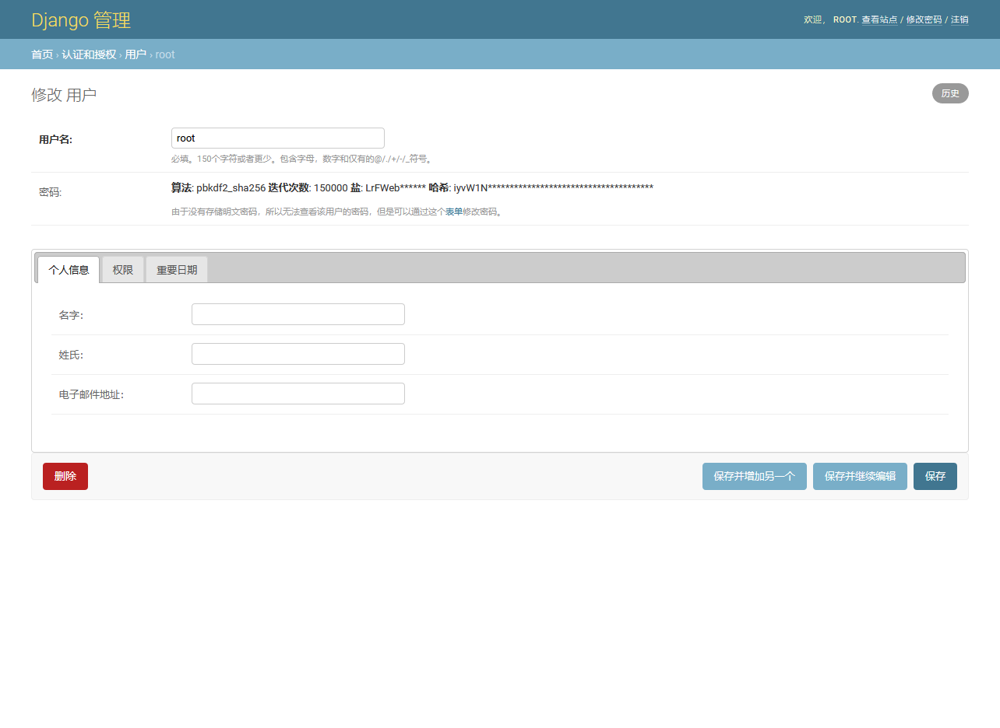
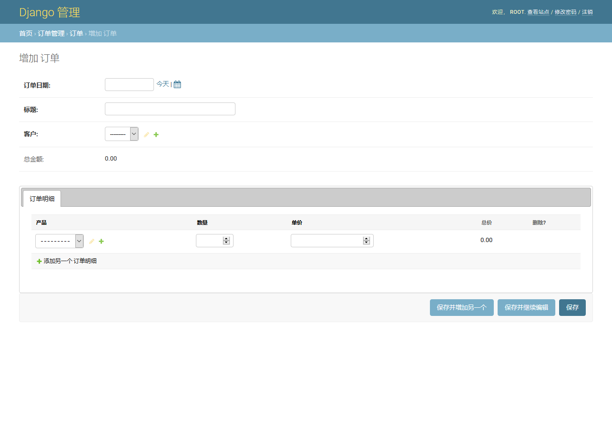

# django admin jqueryui tabs

这是一个修改django admin页面fieldset样式的插件，把原本fieldset列表变成tabs标签样式，提升用户的操作体验。

## 安装

    pip install django-admin-jqueryui-tabs

## 快速开始

    # apps/customauth/admin.py
    from django.contrib import admin
    from django.contrib.auth.admin import UserAdmin
    from django.contrib.auth import get_user_model

    from django_admin_jqueryui_tabs.mixins import ModelAdminTabsMixin

    User = get_user_model()

    class CustomUserAdmin(ModelAdminTabsMixin, UserAdmin):
        pass

    admin.site.unregister(User)
    admin.site.register(User, CustomUserAdmin)

对于 inline 模型，需要配合`TabularInlineTabsMixin`或`StackedInlineTabsMixin`使用

    # apps/order/amdin.py
    from django.contrib import admin
    from django_admin_jqueryui_tabs.mixins import ModelAdminTabsMixin, TabularInlineTabsMixin

    ...

    class OrderItemInline(TabularInlineTabsMixin, admin.TabularInline):
        model = models.OrderItem
        extra = 1
        fields = ('product', 'quantity', 'price', 'amount',)
        readonly_fields = ('amount',)

    class OrderAdmin(ModelAdminTabsMixin, admin.ModelAdmin):
        list_display = ('__str__', 'order_date', 'title', 'amount')
        readonly_fields = ('amount',)
        inlines = (OrderItemInline,)

    admin.site.register(models.Order, OrderAdmin)

